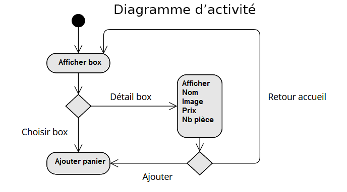

= Sushi
:author: POIRIER Alexandre & BELLIOT Killian
:docdate: 2022-11-21
:asciidoctor-version:1.1
:description: Analyse projet Sushi
:icons: font
:listing-caption: Listing
:toc-title: Table des matières
:toc: left
:toclevels: 4

= Source
Réaliser par l'équipe RedSuns (POIRIER Alexandre & BELLIOT Killian) le 15/03/2023.

Voici d'où vien le projet sushi :

https://ldv-melun.github.io/sio-slam/sio-component/_attachments/SP2-Sushi-Angular-2023.pdf

Voici le lien de notre dépot github :
https://github.com/Naillik77310/Sushi

== 1. Contexte:
Cette situation professionnelle repose sur le développement d’une application Front-end avec le framework Angular pour une prise de commande au niveau d’un point de vente de sushis (restauration)
Deux scénarios peuvent coexister : l’opérateur prend la commande par téléphone pour une livraison à domicile ou le client utilise une borne de commande. On comprend bien pourquoi, étant une application interne, il n’existe pas d’authentification pour l’instant.
Elle utilisera par ailleurs une application Back-end dans le cadre d’une API présentant la gamme de produits à la vente. On se base sur les SushiBoxes de l’entreprise SushiShop afin d’approcher le plus d’une réalité commerciale.

== 1.1 Les attendus fonctionnels demandés :
L’application Web doit permettre à un utilisateur de passer commande de boxes de sushis en vue
d’établir une commande transmissible à la production (cuisine) Elle comportera :
● L’affichage de la liste des boxes Sushi,

● La possibilité de voir le détail d’une boxe,

● La possibilité de sélectionner une ou plusieurs boxes pour un panier de commande,

● Le calcul du montant de la commande,

● La visualisation des commandes sauvegardées localement, (en test, sans habilitation)

● Une page spécifique concernant la mise en place du RGPD (en prévision d’une commande
par internet)

BTS SIO option SLAM – Lycée Léonard de Vinci - Situation Professionnelle n°2

== 1.2 Les attendus techniques demandés :
1. Prise en main d’une API existante (fournie) via une classe de service dédiée à concevoir

2. Définition des structures des données métier (classes)

3. Sauvegarde du panier côté client (LocalStorage) lors de sa validation par le client.

4. Prise en compte d’au moins deux scénarios malveillants

a. Établir un tableau des actions redoutées
b. Proposer des contres-mesures de scénarios malveillants (Evil User Stories)
5. Tests unitaires - en bonus

== 2. Diagrammes:

=== 2.1 Diagramme des différents tiers de l'application:
[plantuml]
----
@startuml
title: Diagramme des tiers
left to right direction
skinparam packageStyle rectangle
actor Client
Client --> (Navigateur Web)
(Navigateur Web) <-->(Serveur HTTP)
(Navigateur Web) <--> (Serveur API)
@enduml
----

=== 2.2 Diagramme de cas d'utilisation pour l'application:

[plantuml]
-----
@startuml
!pragma useVerticalIf on
title Diagramme de cas d'utilisation

left to right direction
actor Utilisateur as user

rectangle Action {

  usecase "Consulter liste des boxs" as UC1
  usecase "Consulter details d'une box" as UC2

  usecase "Selectionner une box" as UC7
  usecase "Gerer panier" as UC9
}

user --> UC1
UC1 <-- UC2
UC1 <-- UC7
UC2 <-- UC7
UC7 <-- UC9
user --> UC9

@enduml
-----

== 3. Maquette:
Voici le lien qui représente la maquette de l'application:
https://www.figma.com/file/jDuWIEKvv1pAiDutf6LeqJ/Untitled?node-id=0%3A1&t=QRdkjubsgVA025tj-1

=== 3.1 Maquette accueil:

=== 3.2 Maquette panier:

=== 3.3 Maquette détails:
